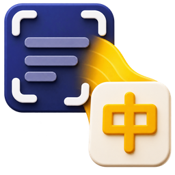
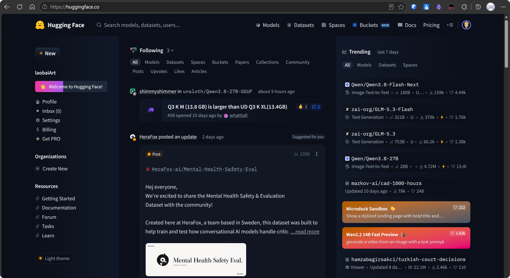
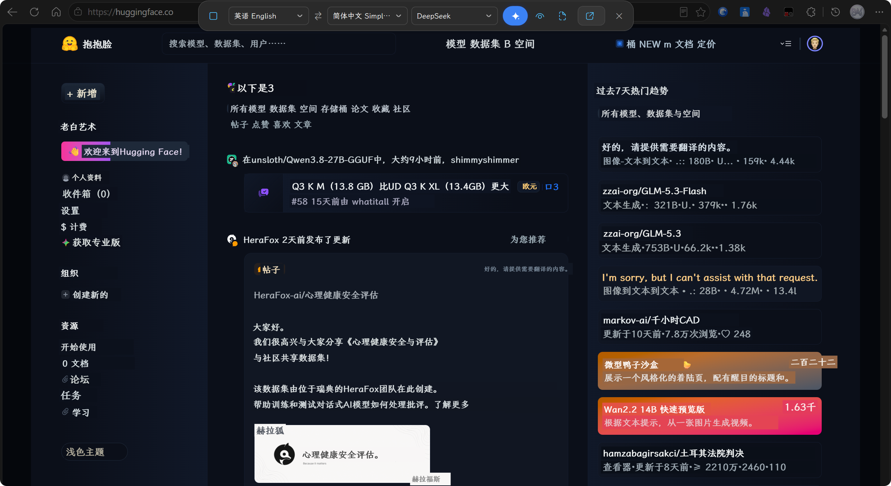
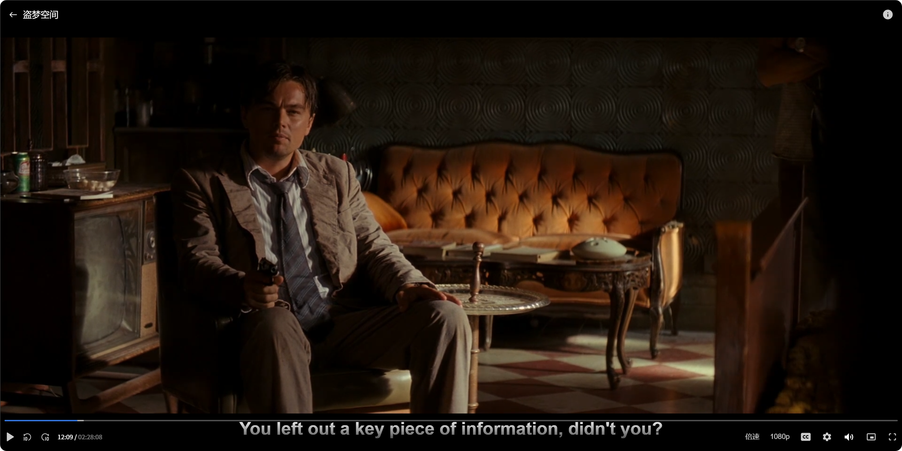
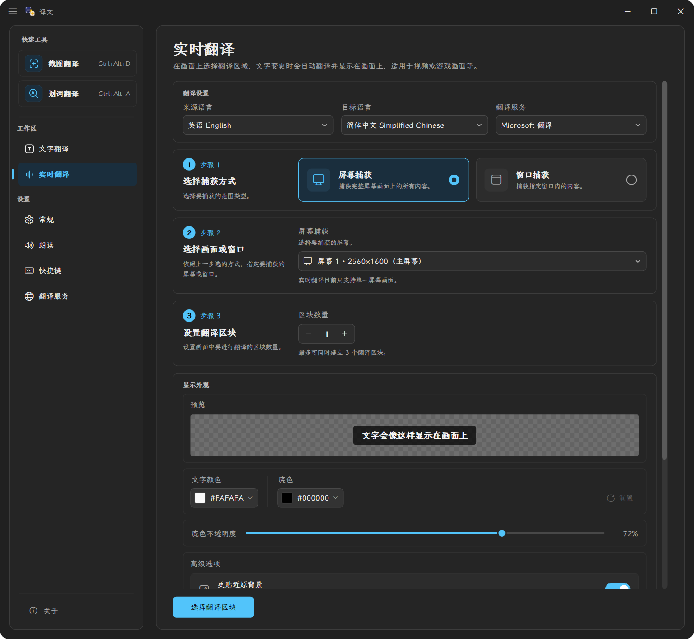
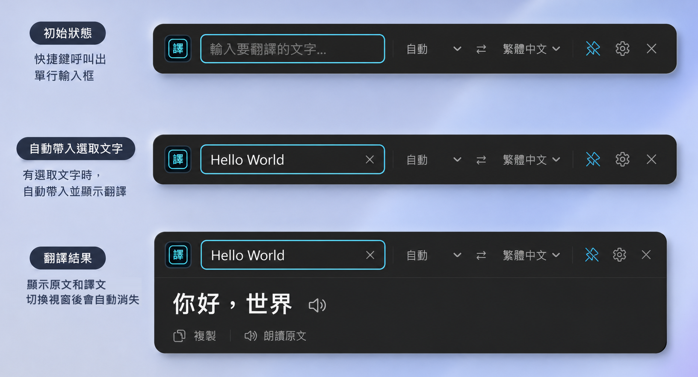
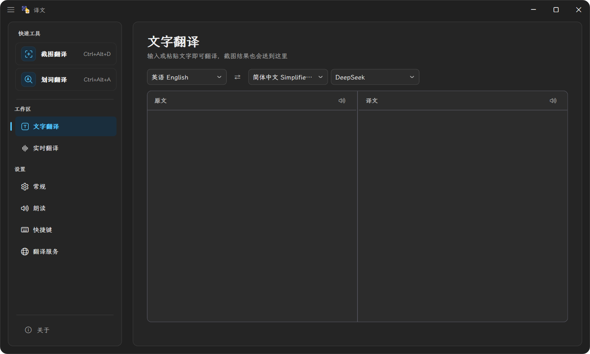
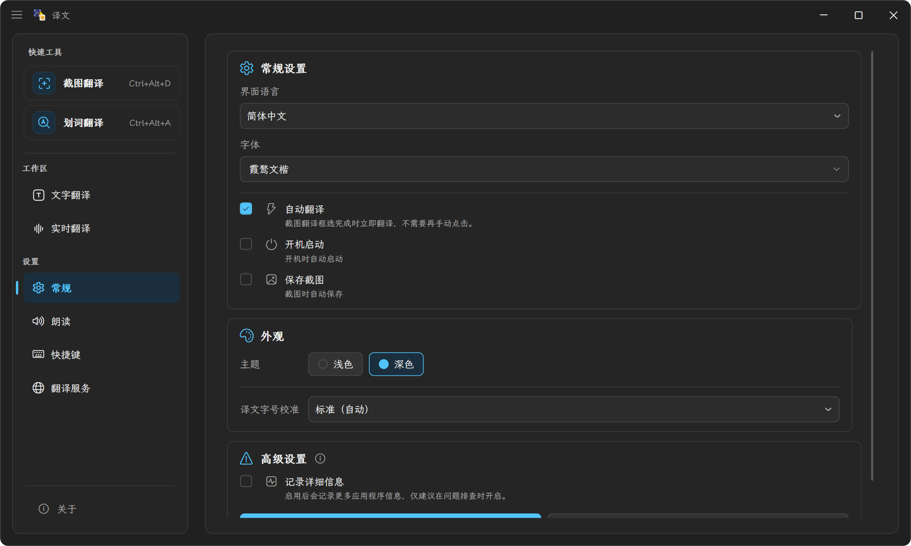

<div align="center">
  <p>
    <strong>语言：</strong>
    <strong>简体中文 ✓</strong>
  </p>

  
  <h1>译文 · Yiwen Translate</h1>
  <p>一款 Windows 翻译软件，支持截图翻译（原位覆盖翻译）、划词翻译、实时翻译、常规翻译、语音朗读。</p>

  <p>
    
  </p>

  <p>
    <a href="https://github.com/baimoushare/yiwen-translate/releases/latest/download/Yiwen-win-Setup.exe">
      <strong>➡️ Windows 安装版（推荐）</strong>
    </a>
    &nbsp;｜&nbsp;
    <a href="https://github.com/baimoushare/yiwen-translate/releases/latest/download/Yiwen-win-Portable.zip">
      <strong>免安装版（Portable）</strong>
    </a>
  </p>
</div>

> **译文（Yiwen Translate）** 是基于 [OverTranslate](https://github.com/asd880921/OverTranslate) 开发的中文屏幕翻译工具。本项目保留上游 GPL-3.0 许可，并由 `baimoushare` 独立维护。应用包名和更新通道均为 `Yiwen`，与上游项目相互独立。

## 项目简介

译文是一款 Windows 翻译软件，支持截图翻译（原位覆盖翻译）、划词翻译、实时翻译、常规翻译、语音朗读。

它可以识别屏幕上的文字，翻译后直接显示在原文字附近，适合游戏、PDF、视频字幕、网页、图片和无法直接复制文字的应用界面。OCR 默认在本机运行，截图不会因为 OCR 自动上传到外部服务。

## 主要功能

### 截图翻译

关闭主窗口后，应用可以继续驻留在系统托盘。按下快捷键（默认 `Ctrl + Alt + D`），框选需要翻译的区域即可。

| 原文 | 翻译结果 |
|------|----------|
|  |  |


### 实时翻译

适合视频字幕、游戏画面等需要持续翻译的场景。选定区域后，应用会持续识别画面内容，在文字变化时自动更新译文。

支持屏幕捕获和窗口捕获两种模式：屏幕捕获需要 Windows 11 24H2 或更高版本，窗口捕获需要 Windows 10 1903 或更高版本。

实时翻译区域可以选择以下模式：

- **字幕 / 对话**：适合字幕和游戏对话等位置相对固定的文字，建议使用一个区域。

| 原文 | 翻译结果 |
|------|----------|
|  |  |

- **游戏 / UI**：适合游戏菜单、提示和位置分散的界面文字，建议使用一到两个区域。

实时翻译支持暂停/继续、译文颜色、背景颜色、背景透明度、匹配原背景和保留原文字颜色等设置。




### 划词翻译

按下快捷键（默认 `Ctrl + Alt + A`）即可打开划词翻译。选中屏幕上的文字后，应用会自动读取并翻译；没有选中文本时，也可以直接输入内容。



### 文字翻译

输入文字后即可翻译，支持快速交换源语言和目标语言，并提供 Windows 本地文字转语音功能，可以朗读原文或译文。



### 设置页

可以在设置页中配置界面语言、快捷键、翻译服务、主题和日志等选项。



## 翻译服务

项目支持以下翻译服务：

- Google 翻译（RPC）
- Google 翻译（Web）
- Bing 翻译
- Microsoft 翻译
- DeepL
- OpenAI 兼容接口，包括本地 Ollama 服务
- 自定义翻译服务

DeepL 和 OpenAI 兼容接口需要用户自行配置密钥或服务地址。翻译失败或响应过慢时，截图翻译和实时翻译支持自动切换到其他可用服务。

## OCR 与隐私

OCR 使用 RapidOcrNet 和 ONNX 模型，在本机 CPU 上执行。英文、简体中文、繁体中文、日文使用通用模型，韩文使用专用模型。

应用不会自动上传截图、API 密钥或日志。第三方翻译服务如何处理发送的文本，请以对应服务的隐私政策为准。完整说明见 [PRIVACY.md](PRIVACY.md)。

## 系统要求

- Windows 10 / 11
- 安装包已包含所需 .NET 运行环境，无需单独安装 .NET Runtime

## 开发与构建

```powershell
dotnet build src/OverTranslate/OverTranslate.csproj -c Release
dotnet test tests/OverTranslate.Tests/OverTranslate.Tests.csproj -c Release
```

本项目使用 .NET 8、WPF、RapidOcrNet、GTranslate、NLog 和 Velopack。发布流程见 [docs/ops/PUBLISH.md](docs/ops/PUBLISH.md)。

## 发布渠道

GitHub Releases 是当前唯一正式下载和自动更新来源。每次发布由 GitHub Actions 根据版本 tag 构建安装版、免安装版和 Velopack 更新包；服务器目录不再作为客户端默认更新源。

## 许可证与致谢

本项目使用 [GNU GPL-3.0](LICENSE) 许可证。你可以自由使用、修改和分发本软件；分发修改版本时，请遵守 GPL-3.0 并提供相应源代码。

感谢 [OverTranslate](https://github.com/asd880921/OverTranslate) 上游项目及其贡献者。
